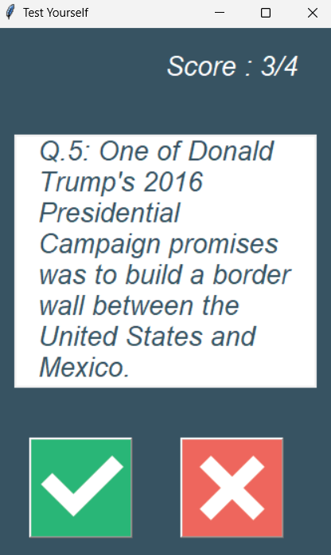

# Quiz Application
## Overview
This is a simple quiz application built using Python and Tkinter GUI library. It allows users to test their knowledge by answering True/False questions fetched from an online API.

##  Features
* User-friendly interface with responsive buttons and score display.
* Questions are fetched from an online API, ensuring a dynamic and diverse quiz experience.
* Immediate feedback on user answers with visual cues.
* Tracks user's score throughout the quiz session.
* Simple and intuitive design suitable for all age groups.

## Prerequisites
* Python 3.x installed on your system.
* Internet connection to fetch questions from the API.
## Installation
Clone the repository to your local machine:

## How to use
* Answer the True/False questions displayed on the interface by clicking the corresponding buttons.
* Receive immediate feedback on your answers and track your score as you progress through the quiz.
## Sample photo

## Acknowledgement.
Thanks to the Open Trivia Database for providing the API used to fetch quiz questions.
